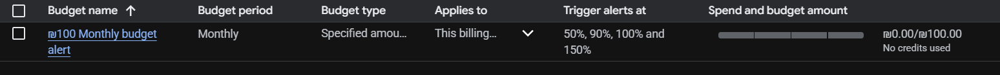

# GCP Setup Checklist — Data Engineering Zoomcamp

## 1. Create Google Cloud Account
- [X] Go to https://cloud.google.com/free
- [X] Sign in with your Google account
- [X] Start the free trial ($300 credit, 90 days)
- [X] Enter billing info (won't be charged unless you manually upgrade)

## 2. Create a Project
- [X] Go to the GCP Console: https://console.cloud.google.com
- [X] Click the project dropdown (top bar) → "New Project"
- [X] Name it (e.g. `de-zoomcamp`)
- [X] Note your **Project ID** — you'll need it for Terraform
  - Project ID: `de-zoomcamp-501007`
  - Project Number: `347194603655`

## 3. Set a Billing Alert
- [X] Go to Billing → Budgets & Alerts
- [X] Create a budget (e.g. $10)
- [X] Set email alerts at 50%, 90%, 100%
- [X] This is your safety net against unexpected charges

## 4. Enable APIs
- [X] Go to APIs & Services → Enable APIs
- [X] Enable **BigQuery API**
- [X] Enable **Cloud Storage API** (also called Cloud Storage JSON API)
- [X] Enable **IAM API** (Identity and Access Management)

## 5. Create a Service Account
- [X] Go to IAM & Admin → Service Accounts
- [X] Click "Create Service Account"
- [X] Name: `terraform-runner` (or similar)
- [X] Grant roles:
  - `BigQuery Admin`
  - `Storage Admin`
  - `Viewer` (basic)
- [X] Click Done

## 6. Download the Service Account Key
- [X] Click on the service account you just created
- [X] Go to Keys tab → Add Key → Create New Key → JSON
- [X] Save the JSON file to a safe location (NOT inside the git repo)
- [X] Suggested location: `~/.gcp/de-zoomcamp-credentials.json`

## 7. Security Checklist
- [X] Add credential files to `.gitignore`
- [X] Never commit `.json` key files to git
- [X] Verify `.gitignore` is working: `git status` should NOT show the key file
- [X] Set minimum permissions on the service account (only what's needed)
- [X] Run security review on Terraform files before applying

## 8. Install Google Cloud SDK (gcloud CLI)
- [X] Download from https://cloud.google.com/sdk/docs/install
- [X] Run the installer
- [X] Run `gcloud init` and follow the prompts
- [X] Set your project: `gcloud config set project de-zoomcamp-501007`
- [ ] Authenticate: `gcloud auth application-default login` ← skipped, not needed for Terraform (uses key file instead)

## 9. Configure Terraform
- [X] Set the `GOOGLE_APPLICATION_CREDENTIALS` environment variable:
  ```powershell
  $env:GOOGLE_APPLICATION_CREDENTIALS = "$HOME\.gcp\de-zoomcamp-credentials.json"
  ```
- [X] Update `terraform/variables.tf` with your Project ID (`de-zoomcamp-501007`)
- [X] Run `terraform init` in the terraform/ directory
- [X] Run `terraform plan` to preview what will be created
- [X] Run `terraform apply` to create the resources ← REQUIRED before step 10

## 10. Verify
- [X] Check GCP Console → BigQuery → you should see the `ny_taxi` dataset
- [X] Check GCP Console → Cloud Storage → you should see the data lake bucket

## Cleanup (when done with the course)
- [ ] `terraform destroy` to remove all cloud resources
- [ ] Delete the service account key
- [ ] Optionally delete the service account
- [ ] Optionally delete the project entirely
